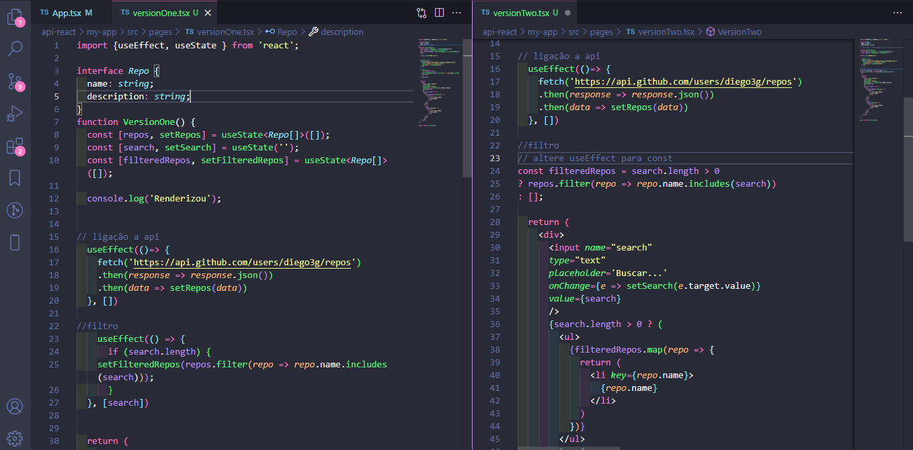

 

  <h1>Bem Vindos(as)!!</h1>
  <strong>Ligação a api em TypeScript</strong>

 

    

## ✌️ Ligação a api em TypeScript * Evitar renderizações
<strong> Fazer funcionar é fácil, mas é o suficiente? Acredito que não. Então tenho focado em como fazer melhor. Sabemos que uma das vantagens do react são as renderizações mas tudo que é demais atrapalha. Aqui temos um modelo simples de ligação a api com o retorno de uma listagem de repositórios do github e um campo de pesquisa. Onde eu utilizo o useEffect duas vezes, o que irá renderizar duas vezes, no segundo exemplo eu troco o useEffect por uma const, o que evita uma renderização e causa o mesmo efeito. Resumindo temos dois resultados iguais com uma renderização a menos. O que isso pode impactar em uma grande aplicação? 

### 🎨 Frontend

*  **Frontend**: ReactJS, Typescript com Visual Studio Code 

## 🙌 Quer Contribuir?

Que tal:
* 🤔 Sugira um recurso
* 🐛 Informar um problema
* 📖 Melhore a documentação
* 👨‍💻 Contribua com o código

Você é mais que bem vindo! 

Obs: Todos os textos e imagens atuais são ficticios, projeto não concluso.

    <h6>Feito com ❤️ by DebsLorena</h6>
    <a href="https://www.linkedin.com/in/loredebs/"><strong>Linkedin</strong></a> 
    <a href="https://www.instagram.com/debslorena/"><strong>Instagram</strong></a>

